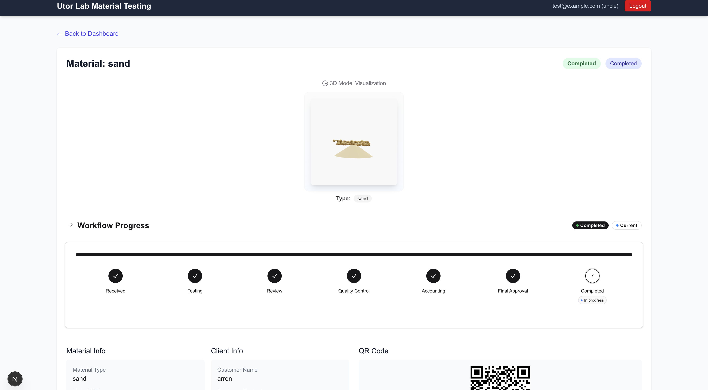
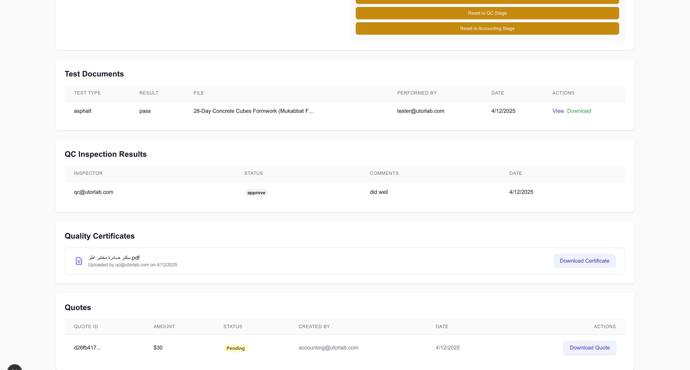

# Utor Lab - Advanced Materials Testing Laboratory Management System

<p align="center">
  
</p>

## 🚀 Overview

Utor Lab is a cutting-edge, enterprise-grade laboratory management system designed to streamline the entire materials testing workflow. Built with modern web technologies, it provides a comprehensive solution for managing material testing processes from initial receipt through final certification and payment.

Our platform serves industry leaders with unparalleled accuracy (99.98% testing accuracy), having completed over 15,000 tests with a 24-hour average turnaround time.

## 🎯 Key Features

### 📊 Intelligent Workflow Management
- **7-Stage Workflow Pipeline**: Seamlessly tracks materials through Received → Testing → Review → Quality Control → Accounting → Final Approval → Completed
- **Role-Based Access Control**: Six distinct user roles (Secretary, Tester, Manager, QC, Accounting, Admin) with stage-specific permissions
- **Real-Time Status Updates**: Live dashboard updates powered by Supabase subscriptions
- **Smart Recovery Options**: Administrative tools to reset materials to previous stages when needed

### 🔬 Advanced Testing Capabilities
- **Multi-Material Support**: Comprehensive testing for cement, steel, sand, bricks, and more
- **Document Management**: Upload, preview, and manage test documents without downloading
- **Template System**: Standardized test forms and procedures for consistency
- **QR Code Tracking**: Unique QR codes for each material enabling instant access and updates

### 📱 Modern User Experience
- **Responsive Design**: Fully optimized for desktop, tablet, and mobile devices
- **3D Visualizations**: Interactive Three.js models for each material type
- **Professional Dashboard**: Clean, intuitive interface with progress indicators
- **File Preview System**: In-app preview for Excel, Word, PDF, and image files

## 🖼️ Screenshots

### Material Detail View with Workflow Progress
<p align="center">
  
</p>

The material detail view showcases our innovative workflow tracking system. Each material moves through seven distinct stages, with real-time progress visualization. The interactive 3D model provides an engaging visual representation of the material being tested, while the QR code enables quick access from mobile devices.

### Comprehensive Test Results & Documentation
<p align="center">
  
</p>

Our comprehensive results dashboard displays all critical information in one place:
- **Test Documents**: Complete test history with downloadable reports
- **QC Inspection Results**: Quality control assessments and approvals
- **Quality Certificates**: Auto-generated certificates with secure verification
- **Quotes**: Professional quote generation with PDF export capability

## 🛠️ Technology Stack

### Frontend
- **Framework**: Next.js 15.2.1 with App Router
- **Language**: TypeScript for type-safe development
- **Styling**: Tailwind CSS v4 with PostCSS for modern, responsive design
- **3D Graphics**: Three.js with React Three Fiber for material visualizations
- **Forms**: React Hook Form for efficient form handling

### Backend & Infrastructure
- **Authentication**: Supabase Auth with role-based access control
- **Database**: Supabase (PostgreSQL) with real-time subscriptions
- **File Storage**: Supabase Storage for document management
- **Real-time Updates**: WebSocket connections for live data synchronization

### Document Processing
- **Excel**: xlsx library for spreadsheet parsing and generation
- **Word**: docx-preview for document visualization
- **PDF**: jsPDF for certificate and quote generation
- **QR Codes**: qrcode.react (generation) and html5-qrcode (scanning)

## 📋 Core Workflows

### 1. Material Registration (Secretary)
```
New Material → Generate QR Code → Initial Classification → Enter System
```

### 2. Testing Process (Tester)
```
Access Material → Upload Test Documents → Submit Results → Move to Review
```

### 3. Quality Assurance Chain
```
Manager Review → QC Inspection → Accounting Quote → Final Approval
```

### 4. Certificate Generation
```
Approved Material → Generate Certificate → Store in System → Available for Download
```

## 🏗️ Project Structure

```
my-app/
├── src/
│   ├── app/                    # Next.js App Router pages
│   │   ├── dashboard/          # Main dashboard interface
│   │   ├── material/           # Material management pages
│   │   │   └── [id]/          # Dynamic material routes
│   │   │       ├── test/      # Testing interface
│   │   │       ├── review/    # Review interface
│   │   │       ├── qc/        # Quality control
│   │   │       ├── accounting/# Quote generation
│   │   │       └── approve/   # Final approval
│   │   └── login/             # Authentication
│   ├── components/            # Reusable React components
│   │   ├── MaterialModels.tsx # 3D material visualizations
│   │   ├── FilePreviewer.tsx  # Document preview system
│   │   └── QrScanner.tsx      # QR code functionality
│   └── lib/                   # Utilities and configurations
│       ├── supabase.ts        # Database configuration
│       └── auth-context.tsx   # Authentication context
```

## 🚀 Getting Started

### Prerequisites
- Node.js 18+ 
- npm or yarn package manager
- Supabase account for backend services

### Installation

1. Clone the repository:
```bash
git clone https://github.com/yourusername/utor-lab.git
cd utor-lab
```

2. Install dependencies:
```bash
npm install
# or
yarn install
```

3. Set up environment variables:
Create a `.env.local` file with your Supabase credentials:
```env
NEXT_PUBLIC_SUPABASE_URL=your_supabase_url
NEXT_PUBLIC_SUPABASE_ANON_KEY=your_supabase_anon_key
```

4. Run the development server:
```bash
npm run dev
# or
yarn dev
```

5. Open [http://localhost:3000](http://localhost:3000) in your browser

## 🔐 Security Features

- **Role-Based Access Control**: Granular permissions for each user type
- **Secure Authentication**: Supabase Auth with JWT tokens
- **Data Encryption**: All sensitive data encrypted at rest
- **Audit Trail**: Complete history of all material status changes
- **Session Management**: Automatic logout and session expiry

## 📈 Performance Optimizations

- **Code Splitting**: Automatic code splitting for faster initial loads
- **Image Optimization**: Next.js Image component for optimized loading
- **Lazy Loading**: Components loaded on-demand
- **Real-time Updates**: Efficient WebSocket connections for live data
- **Caching Strategy**: Smart caching for improved performance

## 🤝 User Roles & Permissions

| Role | Permissions | Access Areas |
|------|------------|--------------|
| **Secretary** | Material registration, completion | New materials, completed items |
| **Tester** | Conduct tests, upload documents | Testing stage materials |
| **Manager** | Review test results | Review stage materials |
| **QC** | Quality inspections | QC stage materials |
| **Accounting** | Generate quotes | Accounting stage materials |
| **Admin (Uncle)** | Full system access | All areas and stages |

## 🌟 Unique Selling Points

1. **Industry-Leading Accuracy**: 99.98% testing accuracy rate
2. **Rapid Turnaround**: 24-hour average processing time
3. **Complete Traceability**: Full audit trail from receipt to completion
4. **Mobile-First Design**: Access from any device, anywhere
5. **Real-Time Collaboration**: Multiple users can work simultaneously
6. **Automated Workflows**: Reduces manual errors and speeds up processes

## 📝 License

This project is proprietary software developed for Utor Lab. All rights reserved.

## 🙏 Acknowledgments

Built with modern web technologies and a commitment to excellence in laboratory management.

---

<p align="center">
  <strong>Utor Lab - Precision Material Testing for Industry Leaders</strong>
</p>